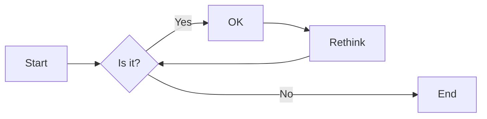
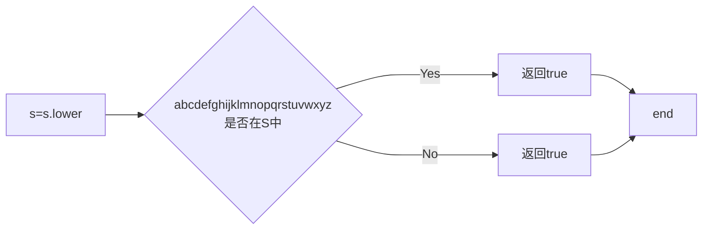

# 实验五 Python数据结构与数据模型

班级： 21计科2

学号： B20210202314

姓名： 朱华畅

Github地址：<https://github.com/Lakzhu/python_project>

CodeWars地址：<https://www.codewars.com/users/Lak%E6%9C%B1>

---

## 实验目的

1. 学习Python数据结构的高级用法
2. 学习Python的数据模型

## 实验环境

1. Git
2. Python 3.10
3. VSCode
4. VSCode插件

## 实验内容和步骤

### 第一部分

在[Codewars网站](https://www.codewars.com)注册账号，完成下列Kata挑战：

---

#### 第一题：停止逆转我的单词

难度： 6kyu

编写一个函数，接收一个或多个单词的字符串，并返回相同的字符串，但所有5个或更多的字母单词都是相反的（就像这个Kata的名字一样）。传入的字符串将只由字母和空格组成。只有当出现一个以上的单词时，才会包括空格。
例如：

```python
spinWords( "Hey fellow warriors" ) => returns "Hey wollef sroirraw" 
spinWords( "This is a test") => returns "This is a test" 
spinWords( "This is another test" )=> returns "This is rehtona test"
```

代码提交地址：
<https://www.codewars.com/kata/5264d2b162488dc400000001>

提示：

- 利用str的split方法可以将字符串分为单词列表
例如：

```python
words = "hey fellow warrior".split()
# words should be ['hey', 'fellow', 'warrior']
```

- 利用列表推导将长度大于等于5的单词反转(利用切片word[::-1])
- 最后使用str的join方法连结列表中的单词。

---

#### 第二题： 发现离群的数(Find The Parity Outlier)

难度：6kyu

给你一个包含整数的数组（其长度至少为3，但可能非常大）。该数组要么完全由奇数组成，要么完全由偶数组成，除了一个整数N。请写一个方法，以该数组为参数，返回这个 "离群 "的N。

例如：

```python
[2, 4, 0, 100, 4, 11, 2602, 36]
# Should return: 11 (the only odd number)

[160, 3, 1719, 19, 11, 13, -21]
# Should return: 160 (the only even number)
```

代码提交地址：
<https://www.codewars.com/kata/5526fc09a1bbd946250002dc>

---

#### 第三题： 检测Pangram

难度：6kyu

pangram是一个至少包含每个字母一次的句子。例如，"The quick brown fox jumps over the lazy dog "这个句子就是一个pangram，因为它至少使用了一次字母A-Z（大小写不相关）。

给定一个字符串，检测它是否是一个pangram。如果是则返回`True`，如果不是则返回`False`。忽略数字和标点符号。
代码提交地址：
<https://www.codewars.com/kata/545cedaa9943f7fe7b000048>

---

#### 第四题： 数独解决方案验证

难度：6kyu

数独背景

数独是一种在 9x9 网格上进行的游戏。游戏的目标是用 1 到 9 的数字填充网格的所有单元格，以便每一列、每一行和九个 3x3 子网格（也称为块）中的都包含数字 1 到 9。更多信息请访问：<http://en.wikipedia.org/wiki/Sudoku>

编写一个函数接受一个代表数独板的二维数组，如果它是一个有效的解决方案则返回 true，否则返回 false。数独板的单元格也可能包含 0，这将代表空单元格。包含一个或多个零的棋盘被认为是无效的解决方案。棋盘总是 9 x 9 格，每个格只包含 0 到 9 之间的整数。

代码提交地址：
<https://www.codewars.com/kata/63d1bac72de941033dbf87ae>

---

#### 第五题： 疯狂的彩色三角形

难度： 2kyu

一个彩色的三角形是由一排颜色组成的，每一排都是红色、绿色或蓝色。连续的几行，每一行都比上一行少一种颜色，是通过考虑前一行中的两个相接触的颜色而产生的。如果这些颜色是相同的，那么新的一行就使用相同的颜色。如果它们不同，则在新的一行中使用缺失的颜色。这个过程一直持续到最后一行，只有一种颜色被生成。

例如：
```python
Colour here:            G G        B G        R G        B R
Becomes colour here:     G          R          B          G
```


一个更大的三角形例子：

```python
R R G B R G B B
 R B R G B R B
  G G B R G G
   G R G B G
    B B R R
     B G R
      R B
       G
```

你将得到三角形的第一行字符串，你的工作是返回最后的颜色，这将出现在最下面一行的字符串。在上面的例子中，你将得到 "RRGBRGBB"，你应该返回 "G"。
限制条件： 1 <= length(row) <= 10 ** 5
输入的字符串将只包含大写字母'B'、'G'或'R'。

例如：

```python
triangle('B') == 'B'
triangle('GB') == 'R'
triangle('RRR') == 'R'
triangle('RGBG') == 'B'
triangle('RBRGBRB') == 'G'
triangle('RBRGBRBGGRRRBGBBBGG') == 'G'
```

代码提交地址：
<https://www.codewars.com/kata/5a331ea7ee1aae8f24000175>

提示：请参考下面的链接，利用三进制的特点来进行计算。
<https://stackoverflow.com/questions/53585022/three-colors-triangles>

---

### 第二部分

使用Mermaid绘制程序流程图

安装VSCode插件：

- Markdown Preview Mermaid Support
- Mermaid Markdown Syntax Highlighting

使用Markdown语法绘制你的程序绘制程序流程图（至少一个），Markdown代码如下：


显示效果如下：



查看Mermaid流程图语法-->[点击这里](https://mermaid.js.org/syntax/flowchart.html)

使用Markdown编辑器（例如VScode）编写本次实验的实验报告，包括[实验过程与结果](#实验过程与结果)、[实验考查](#实验考查)和[实验总结](#实验总结)，并将其导出为 **PDF格式** 来提交。

## 实验过程与结果

请将实验过程与结果放在这里，包括：

- [第一部分 Codewars Kata挑战](#第一部分)
- [第二部分 使用Mermaid绘制程序流程图](#第二部分)

#### 第一题：停止逆转我的单词

```python
def spin_words(sentence):
    lis2 = []
    k = 0
    i=len(sentence.split())
    for n in sentence.split():
        if len(n) >= 5:
            n = n[::-1]
        lis2.append(n)
        if k < i - 1:
            lis2.append(' ')
            k+=1
    return ''.join(lis2)
```

#### 第二题： 发现离群的数(Find The Parity Outlier)

```python
def find_outlier(integers):
    odd = [i for i in integers if i%2 !=0]
    even = [i for i in integers if i%2 ==0]
    return odd[0] if len(odd)< len(even) else even[0]
```

#### 第三题： 检测Pangram

```python
def is_pangram(s):
    s = s.lower()
    for char in 'abcdefghijklmnopqrstuvwxyz':
        if char not in s:
            return False
    return True
```



#### 第四题： 数独解决方案验证

```python
def validate_sudoku(board):
    key = {1,2,3,4,5,6,7,8,9}
    for i in board:
        if key != set(i):
            return False
    for j in zip(*board):
        if key != set(j):
            return False
    for i in range(3,10,3):
        for j in range(3,10,3):
            if key != {(board[q][w]) 
                            for w in range(j-3, j) 
                            for q in range(i-3, i)}:
                return False
    return True
```


**注意：不要使用截图，因为Markdown文档转换为Pdf格式后，截图会无法显示。**

## 实验考查

请使用自己的语言并使用尽量简短代码示例回答下面的问题，这些问题将在实验检查时用于提问和答辩以及实际的操作。

1. 集合（set）类型有什么特点？它和列表（list）类型有什么区别？
   
```python
无序性，唯一性：不可重复，可变性，支持数学运算。而列表是有序的，可以拥有重复的元素，不支持数学运算。
```

2. 集合（set）类型主要有那些操作？
   
```python
add()：添加元素。例如，s.add('a')会将'a'添加到集合s中。

remove()：删除指定元素。例如，s.remove('a')会从集合s中删除'a'。如果元素不存在，会抛出一个KeyError。

discard()：删除指定元素，如果元素不存在，不会抛出错误。

pop()：随机删除并返回集合中的一个元素。如果集合为空，会抛出一个KeyError。

clear()：清空集合中的所有元素。

union()：返回两个集合的并集。

intersection()：返回两个集合的交集。

difference()：返回两个集合的差集。

symmetric_difference()：返回两个集合的对称差集，即只在一个集合中出现的元素。

issubset()：检查一个集合是否是另一个集合的子集。

issuperset()：检查一个集合是否是另一个集合的超集。

isdisjoint()：检查两个集合是否没有交集。
```

3. 使用`*`操作符作用到列表上会产生什么效果？为什么不能使用`*`操作符作用到嵌套的列表上？使用简单的代码示例说明。

```python
在Python中，*操作符可以用于列表（list）的重复。当*操作符作用于一个列表和一个整数时，它会生成一个新的列表，新列表中包含原列表的元素重复指定次数。例如：

list1 = [1, 2, 3]
list2 = list1 * 3
print(list2)  # 输出：[1, 2, 3, 1, 2, 3, 1, 2, 3]
```
4. 总结列表,集合，字典的解析（comprehension）的使用方法。使用简单的代码示例说明。
```python
列表解析（List Comprehension）：列表解析提供了一种简洁的方式来创建列表。它的语法是[expression for item in iterable if condition]。例如：
# 创建一个包含0到9的平方的列表
squares = [x**2 for x in range(10)]
print(squares)  # 输出：[0, 1, 4, 9, 16, 25, 36, 49, 64, 81]
集合解析（Set Comprehension）：集合解析和列表解析类似，只是它使用的是大括号{}。它的语法是{expression for item in iterable if condition}。例如：
# 创建一个包含0到9的平方的集合
squares = {x**2 for x in range(10)}
print(squares)  # 输出：{0, 1, 4, 9, 16, 25, 36, 49, 64, 81}
字典解析（Dictionary Comprehension）：字典解析提供了一种简洁的方式来创建字典。它的语法是{key_expression: value_expression for item in iterable if condition}。例如：
# 创建一个字典，键是0到9，值是它们的平方
squares = {x: x**2 for x in range(10)}
print(squares)  # 输出：{0: 0, 1: 1, 2: 4, 3: 9, 4: 16, 5: 25, 6: 36, 7: 49, 8: 64, 9: 81}
```
## 实验总结

```python
通过对五道编程题的学习，我了解到字符串的分割、倒序、小写等，也了解了数独如何通过二维数组的方式进行按行、按列、按小方块遍历，同时在第五题了解到编程和数学的结合运用。通过对思考题的解答，我明白了集合（set）类型的特点，它和列表（list）类型的区别，以及集合的基本操作。此外，我了解到*操作符的使用方法,使用*操作符作用到列表上会将列表中的元素重复多次。最后，我学习了集合、列表、字典的解析的使用方法。

总之，我更加了解了Python语言的语法，以及如何使用Python语言来解决实际问题。
```
