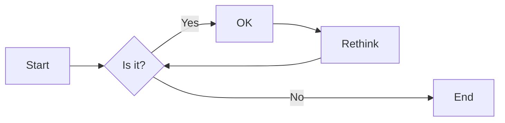

# 实验六 Python函数

班级： 21计科2

学号： B20210202314

姓名： 朱华畅

Github地址：<https://github.com/Lakzhu/python_project>

CodeWars地址：<https://www.codewars.com/users/Lak%E6%9C%B1>

---

## 实验目的

1. 学习Python函数的基本用法
2. 学习lambda函数和高阶函数的使用
3. 掌握函数式编程的概念和实践

## 实验环境

1. Git
2. Python 3.10
3. VSCode
4. VSCode插件

## 实验内容和步骤

### 第一部分

Python函数

完成教材《Python编程从入门到实践》下列章节的练习：

- 第8章 函数

---

### 第二部分

在[Codewars网站](https://www.codewars.com)注册账号，完成下列Kata挑战：

---

#### 第一题：编码聚会1

难度： 7kyu

你将得到一个字典数组，代表关于首次报名参加你所组织的编码聚会的开发者的数据。
你的任务是返回来自欧洲的JavaScript开发者的数量。
例如，给定以下列表：

```python
lst1 = [
  { 'firstName': 'Noah', 'lastName': 'M.', 'country': 'Switzerland', 'continent': 'Europe', 'age': 19, 'language': 'JavaScript' },
  { 'firstName': 'Maia', 'lastName': 'S.', 'country': 'Tahiti', 'continent': 'Oceania', 'age': 28, 'language': 'JavaScript' },
  { 'firstName': 'Shufen', 'lastName': 'L.', 'country': 'Taiwan', 'continent': 'Asia', 'age': 35, 'language': 'HTML' },
  { 'firstName': 'Sumayah', 'lastName': 'M.', 'country': 'Tajikistan', 'continent': 'Asia', 'age': 30, 'language': 'CSS' }
]
```

你的函数应该返回数字1。
如果，没有来自欧洲的JavaScript开发人员，那么你的函数应该返回0。

注意：
字符串的格式将总是"Europe"和"JavaScript"。
所有的数据将始终是有效的和统一的，如上面的例子。

这个卡塔是Coding Meetup系列的一部分，其中包括一些简短易行的卡塔，这些卡塔是为了让人们掌握高阶函数的使用。在Python中，这些方法包括：`filter`, `map`, `reduce`。当然也可以采用其他方法来解决这些卡塔。

[代码提交地址](https://www.codewars.com/kata/coding-meetup-number-1-higher-order-functions-series-count-the-number-of-javascript-developers-coming-from-europe)

---

#### 第二题： 使用函数进行计算

难度：5kyu

这次我们想用函数来写计算，并得到结果。让我们看一下一些例子：

```python
seven(times(five())) # must return 35
four(plus(nine())) # must return 13
eight(minus(three())) # must return 5
six(divided_by(two())) # must return 3
```

要求：

- 从0（"零"）到9（"九"）的每个数字都必须有一个函数。
- 必须有一个函数用于以下数学运算：加、减、乘、除。
- 每个计算都由一个操作和两个数字组成。
- 最外面的函数代表左边的操作数，最里面的函数代表右边的操作数。
- 除法应该是整数除法。

例如，下面的计算应该返回2，而不是2.666666...。

```python
eight(divided_by(three()))
```

代码提交地址：
<https://www.codewars.com/kata/525f3eda17c7cd9f9e000b39>

---

#### 第三题： 缩短数值的过滤器(Number Shortening Filter)

难度：6kyu

在这个kata中，我们将创建一个函数，它返回另一个缩短长数字的函数。给定一个初始值数组替换给定基数的 X 次方。如果返回函数的输入不是数字字符串，则应将输入本身作为字符串返回。

例子：

```python
filter1 = shorten_number(['','k','m'],1000)
filter1('234324') == '234k'
filter1('98234324') == '98m'
filter1([1,2,3]) == '[1,2,3]'
filter2 = shorten_number(['B','KB','MB','GB'],1024)
filter2('32') == '32B'
filter2('2100') == '2KB';
filter2('pippi') == 'pippi'
```

代码提交地址：
<https://www.codewars.com/kata/56b4af8ac6167012ec00006f>

---

#### 第四题： 编码聚会7

难度： 6kyu

您将获得一个对象序列，表示已注册参加您组织的下一个编程聚会的开发人员的数据。

您的任务是返回一个序列，其中包括最年长的开发人员。如果有多个开发人员年龄相同，则将他们按照在原始输入数组中出现的顺序列出。

例如，给定以下输入数组：
```python
list1 = [
  { 'firstName': 'Gabriel', 'lastName': 'X.', 'country': 'Monaco', 'continent': 'Europe', 'age': 49, 'language': 'PHP' },
  { 'firstName': 'Odval', 'lastName': 'F.', 'country': 'Mongolia', 'continent': 'Asia', 'age': 38, 'language': 'Python' },
  { 'firstName': 'Emilija', 'lastName': 'S.', 'country': 'Lithuania', 'continent': 'Europe', 'age': 19, 'language': 'Python' },
  { 'firstName': 'Sou', 'lastName': 'B.', 'country': 'Japan', 'continent': 'Asia', 'age': 49, 'language': 'PHP' },
]
```

您的程序应该返回如下结果：

```python
[
  { 'firstName': 'Gabriel', 'lastName': 'X.', 'country': 'Monaco', 'continent': 'Europe', 'age': 49, 'language': 'PHP' },
  { 'firstName': 'Sou', 'lastName': 'B.', 'country': 'Japan', 'continent': 'Asia', 'age': 49, 'language': 'PHP' },
]
```

注意：

- 输入的列表永远都包含像示例中一样有效的正确格式的数据，而且永远不会为空。

代码提交地址：
<https://www.codewars.com/kata/582887f7d04efdaae3000090>

---

#### 第五题： Currying versus partial application

难度： 4kyu

[Currying versus partial application](https://2ality.com/2011/09/currying-vs-part-eval.html)是将一个函数转换为具有更小arity(参数更少)的另一个函数的两种方法。虽然它们经常被混淆，但它们的工作方式是不同的。目标是学会区分它们。

Currying

是一种将接受多个参数的函数转换为以每个参数都只接受一个参数的一系列函数链的技术。

Currying接受一个函数：

```python
f：X × Y → R
```

并将其转换为一个函数：

```python
f'：X → (Y → R)
```

我们不再使用两个参数调用f，而是使用第一个参数调用f'。结果是一个函数，然后我们使用第二个参数调用该函数来产生结果。因此，如果非curried f被调用为：

```python
f(3, 5)
```

那么curried f'被调用为：

```python
f'(3)(5)
```

示例
给定以下函数：

```python
def add(x, y, z):
  return x + y + z
```

我们可以以普通方式调用：

```python
add(1, 2, 3) # => 6
```

但我们可以创建一个curried版本的add(a, b, c)函数：

```python
curriedAdd = lambda a: (lambda b: (lambda c: add(a,b,c)))
curriedAdd(1)(2)(3) # => 6
```

Partial application
是将一定数量的参数固定到函数中，从而产生另一个更小arity(参数更少)的函数的过程。

部分应用接受一个函数：

```python
f：X × Y → R
```

和一个固定值x作为第一个参数，以产生一个新的函数

```python
f'：Y → R
```

f'与f执行的操作相同，但只需要填写第二个参数，这就是其arity比f的arity少一个的原因。可以说第一个参数绑定到x。

示例:

```python
partialAdd = lambda a: (lambda *args: add(a,*args))
partialAdd(1)(2, 3) # => 6
```

你的任务是实现一个名为curryPartial()的通用函数，可以进行currying或部分应用。

例如：

```python
curriedAdd = curryPartial(add)
curriedAdd(1)(2)(3) # => 6

partialAdd = curryPartial(add, 1)
partialAdd(2, 3) # => 6
```

我们希望函数保持灵活性。

所有下面这些例子都应该产生相同的结果：

```python
curryPartial(add)(1)(2)(3) # =>6 
curryPartial(add, 1)(2)(3) # =>6 
curryPartial(add, 1)(2, 3) # =>6 
curryPartial(add, 1, 2)(3) # =>6 
curryPartial(add, 1, 2, 3) # =>6 
curryPartial(add)(1, 2, 3) # =>6 
curryPartial(add)(1, 2)(3) # =>6 
curryPartial(add)()(1, 2, 3) # =>6 
curryPartial(add)()(1)()()(2)(3) # =>6 

curryPartial(add)()(1)()()(2)(3, 4, 5, 6) # =>6 
curryPartial(add, 1)(2, 3, 4, 5) # =>6 

curryPartial(curryPartial(curryPartial(add, 1), 2), 3) # =>6
curryPartial(curryPartial(add, 1, 2), 3) # =>6
curryPartial(curryPartial(add, 1), 2, 3) # =>6
curryPartial(curryPartial(add, 1), 2)(3) # =>6
curryPartial(curryPartial(add, 1)(2), 3) # =>6
curryPartial(curryPartial(curryPartial(add, 1)), 2, 3) # =>6
```

代码提交地址：
<https://www.codewars.com/kata/53cf7e37e9876c35a60002c9>

---

### 第三部分

使用Mermaid绘制程序流程图

安装VSCode插件：

- Markdown Preview Mermaid Support
- Mermaid Markdown Syntax Highlighting

使用Markdown语法绘制你的程序绘制程序流程图（至少一个），Markdown代码如下：


显示效果如下：



查看Mermaid流程图语法-->[点击这里](https://mermaid.js.org/syntax/flowchart.html)

使用Markdown编辑器（例如VScode）编写本次实验的实验报告，包括[实验过程与结果](#实验过程与结果)、[实验考查](#实验考查)和[实验总结](#实验总结)，并将其导出为 **PDF格式** 来提交。

## 实验过程与结果

请将实验过程与结果放在这里，包括：

- [第一部分 Python函数](#第一部分)
- [第二部分 Codewars Kata挑战](#第二部分)
- [第三部分 使用Mermaid绘制程序流程图](#第三部分)

#### 第一题：编码聚会1

```python
def count_developers(lst):
    lst2 = [d for d in lst
            if d['continent']=='Europe' and d['language']=='JavaScript']
    return len(lst2)
```

```
Time: 1182ms Passed: 102Failed: 0
Test Results:
Example
test case
 (2 of 2 Assertions)
Completed in 0.16ms
Random Tests
Random Test Cases
 (100 of 100 Assertions)
Completed in 518.64ms
You have passed all of the tests! :)
```

#### 第二题： 使用函数进行计算

```python
def zero(fun=None): return fun(0) if fun else 0 
def one(fun=None): return fun(1) if fun else 1
def two(fun=None): return fun(2) if fun else 2
def three(fun=None): return fun(3) if fun else 3
def four(fun=None): return fun(4) if fun else 4
def five(fun=None): return fun(5) if fun else 5
def six(fun=None): return fun(6) if fun else 6
def seven(fun=None): return fun(7) if fun else 7
def eight(fun=None): return fun(8) if fun else 8
def nine(fun=None): return fun(9) if fun else 9

def plus(y): return lambda x:x+y
def minus(y): return lambda x:x-y
def times(y): return lambda x:x*y
def divided_by(y): return lambda x:x//y
```

#### 第三题： 缩短数值的过滤器(Number Shortening Filter)

```python
def shorten_number(suffixes, base):
    def filter(data):
        try:
            number = int(data)
            
        except (TypeError, ValueError):
            return str(data)
        
        else:
            i = 0
            
            while number//base>0 and i<len(suffixes)-1:
                number = number//base
                i = i + 1
            return str(number) + suffixes[i]
        
    return filter
```

#### 第四题： 编码聚会7

```python
def shorten_number(suffixes, base):
    def filter(data):
        try:
            number = int(data)
            
        except (TypeError, ValueError):
            return str(data)
        
        else:
            i = 0
            
            while number//base>0 and i<len(suffixes)-1:
                number = number//base
                i = i + 1
            return str(number) + suffixes[i]
        
    return filter
```

**注意：不要使用截图，Markdown文档转换为Pdf格式后，截图可能会无法显示。**

## 实验考查

请使用自己的语言并使用尽量简短代码示例回答下面的问题，这些问题将在实验检查时用于提问和答辩以及实际的操作。

1. 什么是函数式编程范式？

```python
函数式编程范式是一种编程模式，它将计算视为数学函数的评估，并避免改变状态和可变数据。这种编程范式的主要特点包括：

纯函数：函数的输出仅依赖于其输入参数，不依赖于外部状态，也不改变外部状态。这意味着给定相同的输入，函数总是产生相同的输出。

不可变性：在函数式编程中，数据一旦创建，就不能改变。如果需要修改数据，必须创建一个新的数据。

函数是一等公民：在函数式编程中，函数可以作为参数传递给其他函数，也可以作为其他函数的返回值。此外，函数也可以被赋值给变量，或者存储在数据结构中。
```

2. 什么是lambda函数？请举例说明。

```python
Lambda 函数，也称为匿名函数，是一种在许多编程语言中使用的小型匿名函数。在 Python 中，lambda 函数是一种简洁的定义函数的方式，通常用于编写小型的、一次性的、没有名称的函数对象。

lambda arguments: expression
这里，lambda 关键字是用来声明一个匿名函数，后跟一系列参数，冒号分隔，然后是一个表达式。这个表达式是当调用 lambda 函数时被执行的，而且 lambda 函数可以立即返回一个值，不需要显式地使用 return 语句。

以下是一些 lambda 函数的例子：

例1： 一个简单的 lambda 函数，接受一个参数并返回其平方。

square = lambda x: x * x
print(square(5))  # 输出: 25
例2： 一个接受两个参数的 lambda 函数，返回它们的和。

add = lambda x, y: x + y
print(add(3, 5))  # 输出: 8
```

3. 什么是高阶函数？常用的高阶函数有哪些？这些高阶函数如何工作？使用简单的代码示例说明。

```python
高阶函数是一种在函数式编程中常见的概念，它指的是接受其他函数作为参数，或者返回函数作为结果的函数。高阶函数是函数式编程中"函数是一等公民"这一概念的直接体现。

以下是一些常见的高阶函数：

map()：map() 函数接受一个函数和一个可迭代对象（如列表）作为参数，然后将传入的函数应用到可迭代对象的每一个元素上，返回一个新的可迭代对象。
numbers = [1, 2, 3, 4]
squared = map(lambda x: x ** 2, numbers)
print(list(squared))  # 输出: [1, 4, 9, 16]
filter()：filter() 函数接受一个函数和一个可迭代对象作为参数，然后使用传入的函数对可迭代对象的每一个元素进行判断，如果函数返回 True，则保留该元素，否则丢弃。返回一个新的可迭代对象。
numbers = [1, 2, 3, 4, 5, 6]
even_numbers = filter(lambda x: x % 2 == 0, numbers)
print(list(even_numbers))  # 输出: [2, 4, 6]
reduce()：reduce() 函数在 Python 的 functools 模块中，它接受一个二元函数（接受两个参数的函数）和一个可迭代对象作为参数，然后连续地将二元函数应用到可迭代对象的元素上，每次都将上一次的结果和下一个元素一起作为参数传入函数，最终返回一个单一的结果。
from functools import reduce
numbers = [1, 2, 3, 4]
product = reduce(lambda x, y: x * y, numbers)
print(product)  # 输出: 24
sorted()：sorted() 函数接受一个可迭代对象作为参数，返回一个新的排序后的列表。此外，sorted() 还可以接受一个 key 函数作为参数，这个函数会应用到可迭代对象的每一个元素上，然后根据函数的结果进行排序。
words = ['apple', 'banana', 'cherry', 'date']
sorted_words = sorted(words, key=len)
print(sorted_words)  # 输出: ['date', 'apple', 'cherry', 'banana']
这些高阶函数都是函数式编程中的重要工具，它们可以帮助我们以更简洁、更抽象的方式处理数据和算法。
```
## 实验总结

```python
通过本次实验，我了解到Python中函数的基本用法，学习lambda函数和高阶函数的使用，并了解了函数式编程的概念和实践。在编写书本的相关章节练习题和codewar的编程题时，我了解了如何定义函数、函数的返回值、位置实参、关键字实参、模块，以及函数式编程范式、lambda函数、高阶函数等概念和相应用法。 函数作为Python中的重要章节，在使用范围方面具有广泛性；在编程方面，函数是重要的基础，只有掌握好函数，才能更好的进行编程。
```
